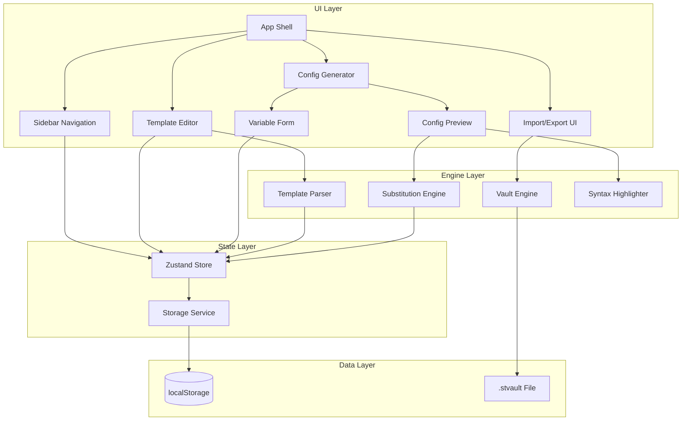

# Design Document

## References

- **Issue:** FORGE-1
- **Spec Path:** `.spec-workflow/specs/FORGE-1-v1-mvp-config-generator/`

## Overview

Forge V1 is a React + Vite + Tailwind single-page application that serves as a network configuration template generator. The app runs entirely in the browser with no backend — all data persists in localStorage, and templates are shared via encrypted `.stvault` files.

The architecture centers on three core engines:
1. **Template Parser** — scans pasted config text for `$variable` / `${variable}` patterns and divider comment patterns, producing a structured template with sections and variables
2. **Config Generator** — performs variable substitution across template sections, producing final config output
3. **Vault Engine** — handles AES-256-GCM encryption/decryption for `.stvault` export/import

The UI follows a Semaphore-inspired View > Vendor > Model > Variant navigation hierarchy with a sidebar tree + main content area layout.

## Steering Document Alignment

### Technical Standards (tech.md)
- React + Vite + Tailwind CSS as agreed in tech steering doc
- Browser-only, no backend — localStorage for persistence
- AES-256-GCM via Web Crypto API for `.stvault` encryption
- No external API calls — fully self-contained
- All dependencies MIT/open source

### Project Structure (structure.md)
- React components in PascalCase (`ModelEditor.jsx`, `ConfigPreview.jsx`)
- Utility modules in kebab-case (`template-parser.js`, `vault-engine.js`)
- Constants in UPPER_SNAKE_CASE
- CSS via Tailwind utility classes + Forge design tokens as CSS custom properties

## Code Reuse Analysis

This is a greenfield project — no existing codebase to leverage. However, the design draws patterns from:

### Existing Components to Leverage
- **Branding Guide** (`/Users/lbruton/Devops/Forge/BRANDING.md`): Complete design token system (colors, typography, spacing, component styles) — will be implemented as Tailwind config + CSS custom properties
- **Seed Template** (`seed-models/cisco-ios-generic.txt`): Real-world Cisco IOS config with 8 variables and 13 natural section boundaries — used for parser testing and shipped as default content

### Integration Points
- **localStorage**: Primary data store — all Views, Vendors, Models, Variants, and preferences
- **Web Crypto API**: Browser-native AES-256-GCM for `.stvault` encryption
- **Clipboard API**: `navigator.clipboard.writeText()` for config copy

## Architecture

### Application Architecture



### Modular Design Principles
- **Single File Responsibility**: Each component handles one concern — `ConfigPreview` renders output, `VariableForm` collects input, `TemplateEditor` handles template creation/editing
- **Engine Isolation**: Template parsing, config generation, and encryption are pure utility modules with no UI dependencies — testable in isolation
- **State Centralization**: Zustand store as single source of truth; components subscribe to slices they need
- **Storage Abstraction**: All localStorage access goes through `StorageService` — enables future migration to IndexedDB or backend API

## Components and Interfaces

### App Shell (`App.jsx`)
- **Purpose:** Root layout — sidebar + main content area with routing
- **Interfaces:** Renders `<Sidebar>` and routes to `<ConfigGenerator>`, `<TemplateEditor>`, or `<WelcomeScreen>` based on selection
- **Dependencies:** React Router (hash-based routing for static hosting compatibility), Zustand store

### Sidebar (`Sidebar.jsx`)
- **Purpose:** Tree navigation for View > Vendor > Model > Variant hierarchy
- **Interfaces:** `onSelect(nodeType, nodeId)` — fires when user clicks a tree node; context menu for CRUD + export
- **Dependencies:** Zustand store for tree data, Lucide icons
- **Sub-components:**
  - `TreeNode.jsx` — recursive tree item renderer
  - `NodeContextMenu.jsx` — right-click actions (Edit, Delete, Export, Add Child)
  - `CreateNodeModal.jsx` — modal form for creating Views, Vendors, Models, Variants

### Template Editor (`TemplateEditor.jsx`)
- **Purpose:** Config paste + edit interface for creating/editing Variant templates
- **Interfaces:** Large textarea for config paste, "Save" button triggers parse + persist
- **Dependencies:** Template Parser engine, Zustand store
- **Sub-components:**
  - `VariableDetectionPanel.jsx` — shows auto-detected variables with type editing
  - `SectionPreview.jsx` — shows detected section boundaries before saving
  - `DividerGuide.jsx` — inline help text explaining supported divider formats

### Config Generator (`ConfigGenerator.jsx`)
- **Purpose:** Main workspace — variable form + live config preview for a selected Variant
- **Interfaces:** Renders variable inputs and config output side-by-side (or stacked on mobile)
- **Dependencies:** Zustand store, Substitution Engine, Syntax Highlighter
- **Sub-components:**
  - `VariableForm.jsx` — auto-generated form from variable definitions
  - `VariableInput.jsx` — typed input (text, IP validator, dropdown, interface builder toggle)
  - `ConfigPreview.jsx` — syntax-highlighted output with line numbers
  - `SectionTabs.jsx` — tab bar for section selection + "All Sections" view
  - `CopyButton.jsx` — per-section and full-config copy with toast confirmation
  - `InterfaceBuilder.jsx` — port count selector + template chooser for interface ranges

### Import/Export UI (`VaultModal.jsx`)
- **Purpose:** Modal for `.stvault` encrypted export and import
- **Interfaces:** Export: select scope + enter password → download. Import: select file + enter password → merge.
- **Dependencies:** Vault Engine
- **Sub-components:**
  - `ExportDialog.jsx` — scope selector (selected node or entire library) + password input + confirm
  - `ImportDialog.jsx` — file picker + password input + conflict resolution UI

### Welcome Screen (`WelcomeScreen.jsx`)
- **Purpose:** Empty state when no templates exist — "The forge is cold" messaging
- **Interfaces:** Offers "Load Seed Template" and "Import .stvault" actions
- **Dependencies:** Zustand store, seed data

## Data Models

### Navigation Tree (localStorage: `forge_tree`)
```typescript
interface ForgeTree {
  views: View[];
}

interface View {
  id: string;              // crypto.randomUUID()
  name: string;            // e.g., "HomeLab", "Work"
  vendors: Vendor[];
  createdAt: string;       // ISO timestamp
  updatedAt: string;
}

interface Vendor {
  id: string;
  name: string;            // e.g., "Cisco"
  configFormat: ConfigFormat; // "cli" | "xml" | "json" | "yaml"
  models: Model[];
  createdAt: string;
  updatedAt: string;
}

interface Model {
  id: string;
  name: string;            // e.g., "IE3300", "C9200L"
  description: string;
  variants: Variant[];
  createdAt: string;
  updatedAt: string;
}

interface Variant {
  id: string;
  name: string;            // e.g., "Generic Template", "Site A"
  templateId: string;      // references a Template object
  createdAt: string;
  updatedAt: string;
}

type ConfigFormat = "cli" | "xml" | "json" | "yaml";
```

### Template (localStorage: `forge_template_{id}`)
```typescript
interface Template {
  id: string;
  sections: TemplateSection[];
  variables: VariableDefinition[];
  rawSource: string;       // original pasted config (for re-parsing)
  createdAt: string;
  updatedAt: string;
}

interface TemplateSection {
  id: string;
  name: string;            // e.g., "Generic IOS Config", "ISE Config"
  template: string;        // section text with $variable placeholders
  order: number;
  dividerPattern: string;  // original divider line (for output reconstruction)
}

interface VariableDefinition {
  name: string;            // e.g., "hostname", "vlan_95_ip_address"
  label: string;           // e.g., "Hostname", "VLAN 95 IP Address"
  type: VariableType;
  defaultValue: string;
  options: string[];       // for dropdown type
  required: boolean;
  description: string;
}

type VariableType = "string" | "ip" | "integer" | "dropdown";
```

### Variable Values (localStorage: `forge_values_{variantId}`)
```typescript
interface VariableValues {
  variantId: string;
  values: Record<string, string>;  // variableName → current value
  updatedAt: string;
}
```

### App Preferences (localStorage: `forge_preferences`)
```typescript
interface Preferences {
  lastSelectedVariantId: string | null;
  sidebarCollapsed: boolean;
  expandedNodes: string[];    // IDs of expanded tree nodes
}
```

## Engine Design

### Template Parser (`lib/template-parser.ts`)

**Input:** Raw config text (string)
**Output:** `{ sections: TemplateSection[], variables: VariableDefinition[] }`

**Variable Detection:**
- Regex: `/\$\{([a-zA-Z_][a-zA-Z0-9_]*)\}|\$([a-zA-Z_][a-zA-Z0-9_]*)/g`
- Must distinguish template variables from config literals like `$9$...` (Cisco type-9 passwords) — reject variables starting with digits after `$`
- Deduplicate across sections

**Section Detection:**
- CLI dividers: `/^[!#]{1,3}#{3,}\s*(.*?)\s*#{3,}/` and `/^#{3,}\s*(.*?)\s*#{3,}/` and `/^[!#]{3,}\s+(.*?)\s+[!#]{3,}/`
- XML dividers: `/^<!--\s*(.*?)\s*-->/`
- YAML dividers: `/^#\s*={3,}\s*(.*?)(?:\s*={3,})?/` or `/^#{3,}\s*(.*?)\s*#{3,}/`
- Fallback: single section "Full Config" if no dividers detected

**Type Inference:**
- Variable name contains `ip` or `address` → suggest `ip`
- Variable name contains `gateway` → suggest `ip`
- Variable name contains `range` or `port` → suggest `string` with description hint
- Variable name contains `vlan` and `id` → suggest `integer`
- Default → `string`

### Substitution Engine (`lib/substitution-engine.ts`)

**Input:** `Template`, `Record<string, string>` (variable values)
**Output:** `{ fullConfig: string, sections: { name: string, content: string }[] }`

**Process:**
1. For each section, clone the template text
2. Replace all `$variable` and `${variable}` occurrences with corresponding values
3. If a variable has no value, leave the placeholder as-is (highlighted in preview)
4. Reconstruct section dividers in output
5. Return both per-section and concatenated output

### Vault Engine (`lib/vault-engine.ts`)

**Export flow:**
1. Serialize selected tree nodes + templates to JSON
2. Generate random 96-bit IV
3. Derive key from password via PBKDF2 (SHA-256, 100,000 iterations, 256-bit key)
4. Encrypt JSON with AES-256-GCM
5. Package as: `{ version: 1, iv: base64, salt: base64, iterations: 100000, data: base64 }`
6. Save as `.stvault` file (JSON envelope — encrypted payload is opaque binary)

**Import flow:**
1. Read `.stvault` file, parse JSON envelope
2. Derive key from password using stored salt + iterations
3. Decrypt with AES-256-GCM using stored IV
4. Parse decrypted JSON → validate structure
5. Merge into existing tree (prompt on conflicts)

### Syntax Highlighter (`lib/syntax-highlighter.ts`)

**Approach:** Custom lightweight highlighter using regex token rules per format. Avoids heavy dependencies like Monaco or CodeMirror for v1 — the config preview is read-only, so a full editor is unnecessary.

**Cisco CLI tokens:**
- Keywords: `hostname`, `interface`, `ip address`, `switchport`, `vlan`, `access-list`, `permit`, `deny`, `shutdown`, `no`, `service`, `aaa`, `radius`, `tacacs`, `dot1x`, `snmp-server`, `logging`, `ntp`, `banner`, `line`, `crypto`, `spanning-tree`
- IP addresses: `/\b\d{1,3}\.\d{1,3}\.\d{1,3}\.\d{1,3}\b/`
- Numbers: `/\b\d+\b/`
- Comments: `/^!.*/` (lines starting with `!`)
- Interfaces: `/\b(Gi|Te|Fa|Vlan|Lo)\S*/`
- Variables (unsubstituted): `/\$\{?[a-zA-Z_]\w*\}?/` → highlighted in amber

**Other formats:** XML, JSON, YAML use standard syntax patterns (tags/attributes, keys/values/strings, keys/values).

## UI Impact Assessment

### Has UI Changes: Yes

### Visual Scope
- **Impact Level:** New application — all screens are new
- **Components Affected:** All components listed above (App Shell, Sidebar, Template Editor, Config Generator, Variable Form, Config Preview, Section Tabs, Interface Builder, Vault Modal, Welcome Screen)
- **Prototype Required:** Yes — multiple data elements, new layout, complex interactions (tree nav, tabbed preview, variable form generation)

### Prototype Artifacts
- **Stitch Screen IDs:** N/A (mockup used instead)
- **Mockup File:** `.spec-workflow/specs/FORGE-1-v1-mvp-config-generator/artifacts/mockup.html`
- **Playground File:** `.spec-workflow/specs/FORGE-1-v1-mvp-config-generator/artifacts/playground.html`
- **Reference HTML/Mockup:** `/Users/lbruton/Devops/Forge/forge-brand-showcase.html` — branding reference (colors, typography, component styles)
- **Visual Approval:** Approved 2026-03-23 with implementation notes (see below)

### Implementation Notes from Visual Approval
- Fresh app must show welcome screen only — no pre-loaded seed data
- "Add Template" flow needs a proper modal/wizard: View > Vendor > Model > Variant fields BEFORE the paste textarea
- Template editor: $variables highlighted in amber/bold — NOT full syntax highlighting (that's only in the preview)
- Each section tab needs its own copy + download button (not just global copy/download)
- Export .stvault button needed in header or sidebar — missing from prototype
- Editor is raw text input; syntax highlighting applies only to the generated config preview

### Design Constraints
- **Theme Compatibility:** Dark mode only (per branding guide)
- **Existing Patterns to Match:** Branding guide component styles (buttons, inputs, cards, navigation) — see `BRANDING.md`
- **Responsive Behavior:** Desktop-first (primary use case is engineers at workstations). Sidebar collapses on narrow viewports. Config preview stacks below variable form on mobile.

### Visual Approval Gate
> **BLOCKING:** Prototype required before UI implementation begins. The branding showcase HTML provides color/typography reference, but a functional prototype showing the actual app layout (sidebar + generator + preview) is needed.

## Open Questions

### Blocking (must resolve before approval)

None — all key decisions resolved during requirements and chat.

### Resolved

- [x] ~~Syntax highlighting approach~~ — Custom lightweight highlighter for v1 (read-only preview doesn't need a full editor). Keeps bundle small, avoids Monaco/CodeMirror weight. Can upgrade later if users want editable preview.
- [x] ~~State management~~ — Zustand (tiny, no boilerplate, works well with localStorage persistence middleware)
- [x] ~~Template storage strategy~~ — Tree structure in one localStorage key (`forge_tree`), templates in separate keys (`forge_template_{id}`). Avoids hitting localStorage per-key size limits with large templates.
- [x] ~~Cisco password literal handling~~ — Parser must exclude `$9$...` patterns (Cisco type-9 hashed passwords) from variable detection. Regex requires variable names to start with a letter or underscore.

## Error Handling

### Error Scenarios

1. **Corrupted localStorage**
   - **Handling:** Wrap all `JSON.parse()` calls in try/catch. On corruption, offer to reset specific keys or full reset. Never crash.
   - **User Impact:** Toast notification: "Some data couldn't be loaded. Would you like to reset?" with options to reset or export what's recoverable.

2. **Wrong .stvault password**
   - **Handling:** AES-GCM decryption throws on wrong key. Catch the error, do not modify any existing data.
   - **User Impact:** "Incorrect password. Please try again." No data loss risk.

3. **Malformed .stvault file**
   - **Handling:** Validate JSON envelope structure before attempting decryption. Validate decrypted data schema before merging.
   - **User Impact:** "This file doesn't appear to be a valid .stvault archive."

4. **localStorage quota exceeded**
   - **Handling:** Catch `QuotaExceededError` on writes. Calculate approximate usage and display warning when approaching limit.
   - **User Impact:** Warning banner: "Storage is nearly full (X MB / ~5 MB). Export and remove unused templates to free space."

5. **Variable name collision during import**
   - **Handling:** Detect name-path conflicts (same View > Vendor > Model > Variant name). Prompt user to overwrite, skip, or rename.
   - **User Impact:** Conflict resolution dialog listing each conflict with action options.

## Testing Strategy

### Unit Tests (Vitest)
- Template Parser: variable detection, section splitting, type inference, Cisco password literal exclusion
- Substitution Engine: single/multi-section replacement, missing variables, cross-section variable reuse
- Vault Engine: encrypt/decrypt round-trip, wrong password rejection, malformed file handling
- Storage Service: CRUD operations, namespace isolation, corruption recovery

### Integration Tests (Vitest + React Testing Library)
- Template creation flow: paste → detect → save → verify in store
- Config generation flow: select variant → fill variables → verify preview output
- Import/export flow: export → import into fresh store → verify data integrity

### Manual Verification
- Cross-browser testing (Chrome, Firefox, Safari)
- Responsive layout at desktop, tablet, mobile widths
- Copy-to-clipboard across browsers
- Docker container deployment verification
