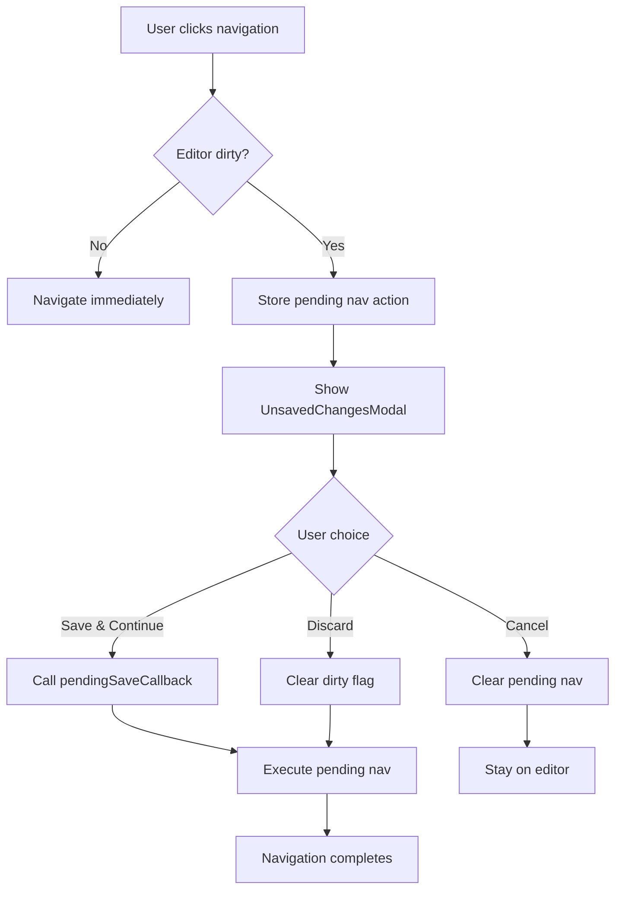

# Design Document

## References

- **Issue:** FORGE-10
- **Spec Path:** `.spec-workflow/specs/FORGE-10-unsaved-changes-warning/`

## Overview

Add a dirty state flag to the Zustand store, intercept all navigation actions that would leave the template editor, and show a confirmation modal when unsaved changes exist. The design centralizes the guard logic in App.tsx with a "pending navigation" pattern — navigation actions are captured, held while the modal is shown, and executed only after the user confirms.

## Steering Document Alignment

### Technical Standards (tech.md)
- Browser-native, no new dependencies. Uses existing Zustand store patterns and React state.
- No backend changes — purely frontend UX guard.

### Project Structure (structure.md)
- One new component file (UnsavedChangesModal.tsx). All other changes in existing files.
- Follows component naming (PascalCase), function naming (camelCase) conventions.

## Code Reuse Analysis

### Existing Components to Leverage
- **CreateNodeModal** (`src/components/CreateNodeModal.tsx`): Overlay pattern — `z-50`, `bg-black/60`, centered box, Escape to close, backdrop click to close. UnsavedChangesModal will follow this exact pattern.
- **Zustand store** (`src/store/index.ts`): Add `editorDirty` flag and `pendingSaveCallback` to existing store. No new store needed.

### Integration Points
- **App.tsx**: Central navigation guard. All navigation triggers (mode switch, variant select, global vars select) flow through App.tsx — this is where the modal state and pending navigation live.
- **TemplateEditor.tsx**: Sets dirty flag on any edit. Exposes save callback to store so App.tsx can trigger "Save & Continue".
- **Sidebar.tsx**: No changes needed — sidebar calls store methods which App.tsx already controls.

## Architecture

The design uses a **pending navigation** pattern:



### Key Design Decision: Where the Guard Lives

The guard lives in **App.tsx**, not in the store. Rationale:
- App.tsx owns `mode` state (editor vs generator) and renders `renderMainContent()`
- App.tsx already wraps all navigation handlers (`handleSelectVariant`, sidebar callbacks)
- The modal is React UI — it belongs in the component tree, not in Zustand
- Store only holds the `editorDirty` flag and `pendingSaveCallback` — minimal additions

## Components and Interfaces

### UnsavedChangesModal (CREATE)
- **Purpose:** Confirmation dialog shown when navigating away from dirty editor
- **Props:** `{ open: boolean, onSave: () => void, onDiscard: () => void, onCancel: () => void }`
- **Dependencies:** None (self-contained presentational component)
- **Reuses:** CreateNodeModal overlay/escape/backdrop pattern

### App.tsx (MODIFY)
- **Changes:**
  - Add `pendingNavAction` state: `(() => void) | null` — stores the deferred navigation callback
  - Wrap all navigation handlers with a guard: `guardNavigation(navAction)` checks `editorDirty`, either executes immediately or stores as pending
  - Add `handleSaveAndContinue`, `handleDiscard`, `handleCancelNav` handlers for the modal
  - Render `<UnsavedChangesModal>` at the top of the component tree
- **Reuses:** Existing handler patterns (useCallback)

### TemplateEditor.tsx (MODIFY)
- **Changes:**
  - Call `setEditorDirty(true)` on any edit (text change, variable change, section reorder)
  - Call `setEditorDirty(false)` after successful save
  - Register a save callback with the store on mount: `setPendingSaveCallback(handleSave)` so App.tsx can trigger save externally
  - Clean up on unmount: `setPendingSaveCallback(null)`
- **Reuses:** Existing `handleSave` function

### Store (MODIFY)
- **New state:**
  - `editorDirty: boolean` — is the editor in a dirty state?
  - `pendingSaveCallback: (() => void) | null` — reference to TemplateEditor's save function
- **New actions:**
  - `setEditorDirty(dirty: boolean)` — set/clear the dirty flag
  - `setPendingSaveCallback(cb: (() => void) | null)` — register/unregister save callback

## Data Models

No new data models. Only new store state fields:

```typescript
// Added to ForgeStore interface
editorDirty: boolean;
pendingSaveCallback: (() => void) | null;
setEditorDirty: (dirty: boolean) => void;
setPendingSaveCallback: (cb: (() => void) | null) => void;
```

## UI Impact Assessment

### Has UI Changes: Yes

### Visual Scope
- **Impact Level:** New modal
- **Components Affected:** UnsavedChangesModal (new), App.tsx (modal rendering)
- **Prototype Required:** No — simple 3-button confirmation dialog with clear text analogues in existing modals

### Design Constraints
- **Theme Compatibility:** Dark mode only (Forge dark-mode-only)
- **Existing Patterns to Match:** CreateNodeModal overlay style, button colors (amber for primary action, slate for secondary)
- **Responsive Behavior:** N/A — desktop-only tool

## Open Questions

### Resolved

- [x] ~~Should dirty detection compare actual content or use a simple flag?~~ — Simple flag. Set on any edit event, clear on save. Content comparison adds complexity with no user benefit — if the user made and then unmade an edit, the flag stays set, which is the safe behavior (better to prompt unnecessarily than lose work).
- [x] ~~How does "Save & Continue" trigger save from outside TemplateEditor?~~ — TemplateEditor registers its `handleSave` as `pendingSaveCallback` in the store on mount. App.tsx calls it via `store.pendingSaveCallback()`.
- [x] ~~Should the dirty flag persist across sessions?~~ — No. The flag is runtime-only React/Zustand state. If the user refreshes, TemplateEditor remounts with clean state from persisted template data.

## Error Handling

### Error Scenarios
1. **Save fails during "Save & Continue"**
   - **Handling:** If `pendingSaveCallback` throws, catch in App.tsx, keep modal open, show error toast
   - **User Impact:** User sees error, can retry or discard

2. **pendingSaveCallback is null when "Save & Continue" clicked**
   - **Handling:** Should not happen (TemplateEditor registers on mount). If it does, treat as discard with a console warning.
   - **User Impact:** Navigation proceeds, changes may be lost (defensive fallback)

## Testing Strategy

### Unit Tests
- Test dirty flag: set on edit, clear on save, clear on discard
- Test guard logic: dirty → shows modal, clean → navigates immediately

### Manual Verification
- Edit template text, click Generate tab → modal appears
- Click "Save & Continue" → saves, switches to Generate
- Click "Discard" → switches to Generate without saving
- Click "Cancel" → stays on editor
- Edit template, close browser tab → beforeunload fires
- No edits, click Generate → no modal, immediate navigation
