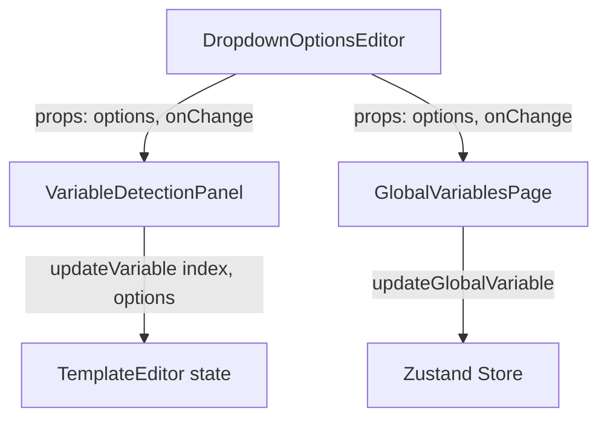

# Design Document

## References

- **Issue:** FORGE-12
- **Spec Path:** `.spec-workflow/specs/FORGE-12-dropdown-variable-options-editor/`

## Overview

Add a shared `DropdownOptionsEditor` component that renders when a variable's type is 'dropdown'. It provides add/remove functionality for the `options: string[]` array. Used in both VariableDetectionPanel (local variables) and GlobalVariablesPage (global variables). No store or data model changes needed — the options field already exists and persists correctly.

## Steering Document Alignment

### Technical Standards (tech.md)
- Browser-native, no new dependencies. Standard React controlled inputs.
- No backend changes — options persist via existing localStorage/Zustand flows.

### Project Structure (structure.md)
- One new component file (`DropdownOptionsEditor.tsx`). Integration into two existing components.
- Follows PascalCase component naming, camelCase functions.

## Code Reuse Analysis

### Existing Components to Leverage
- **VariableDetectionPanel** (`src/components/VariableDetectionPanel.tsx`): Already renders the type selector and expanded variable edit form. The options editor slots in below the type selector when type === 'dropdown'.
- **GlobalVariablesPage** (`src/components/GlobalVariablesPage.tsx`): Already renders type selector in the variable edit form. Same integration point.
- **Existing input styling**: Both components use `bg-forge-obsidian border border-forge-graphite rounded-lg text-sm text-slate-200` pattern for inputs — the options editor must match.

### Integration Points
- **VariableDetectionPanel `updateVariable`** (`src/components/VariableDetectionPanel.tsx`): Already accepts `Partial<VariableDefinition>` updates. Calling `updateVariable(index, { options: newOptions })` will work without any changes.
- **GlobalVariablesPage `handleUpdateGlobal`**: Already calls `updateGlobalVariable(viewId, oldName, updates)` which persists to the store. Passing `{ options: newOptions }` will work.

## Architecture

Simple component composition — no new state management:



## Components and Interfaces

### DropdownOptionsEditor (CREATE)
- **Purpose:** Add/remove string options for a dropdown-type variable
- **Props:**
  ```typescript
  interface DropdownOptionsEditorProps {
    options: string[];
    onChange: (options: string[]) => void;
  }
  ```
- **Behavior:**
  - Text input + "Add" button in a row
  - Enter key in input triggers add (same as clicking Add)
  - Duplicate check: if option already exists, don't add (optionally flash input)
  - Empty string: don't add blank options
  - List of current options below, each with option text + X delete button
  - Empty state: "Add at least one option" hint text (text-slate-500, text-xs)
  - On add: `onChange([...options, newValue])`, clear input
  - On remove: `onChange(options.filter((_, i) => i !== index))`
- **Dependencies:** None (pure presentational component)
- **Styling:** Match surrounding variable edit controls:
  - Input: `bg-forge-obsidian border border-forge-graphite rounded-lg text-sm text-slate-200 px-3 py-1.5`
  - Add button: `bg-forge-graphite text-slate-400 hover:text-slate-200 rounded-lg px-3 py-1.5 text-sm`
  - Option row: `flex items-center justify-between py-1 px-2 bg-forge-obsidian/50 rounded text-sm text-slate-300`
  - Delete button: `text-slate-500 hover:text-red-400` with X icon (14px)

### VariableDetectionPanel (MODIFY)
- **Changes:** When expanded variable has `type === 'dropdown'`, render `<DropdownOptionsEditor>` below the type selector
- **Props passed:** `options={variable.options}` and `onChange={(newOptions) => updateVariable(index, { options: newOptions })}`
- **No other changes needed**

### GlobalVariablesPage (MODIFY)
- **Changes:** When editing a global variable with `type === 'dropdown'`, render `<DropdownOptionsEditor>` below the type selector
- **Props passed:** `options={editValues.options}` and `onChange={(newOptions) => setEditValues({ ...editValues, options: newOptions })}`
- **No other changes needed**

## Data Models

No changes. `VariableDefinition.options: string[]` already exists and is persisted.

## UI Impact Assessment

### Has UI Changes: Yes

### Visual Scope
- **Impact Level:** Minor element additions — conditional render inside existing expanded variable forms
- **Components Affected:** DropdownOptionsEditor (new), VariableDetectionPanel (integration), GlobalVariablesPage (integration)
- **Prototype Required:** No — simple input + list pattern with clear analogues in the existing UI (variable rows, input styling)

### Design Constraints
- **Theme Compatibility:** Dark mode only (Forge)
- **Existing Patterns to Match:** Variable edit form inputs in VariableDetectionPanel (same input class, same spacing)
- **Responsive Behavior:** N/A — desktop-only tool

## Open Questions

### Resolved

- [x] ~~Shared component or inline?~~ — Shared `DropdownOptionsEditor` component, used in both locations
- [x] ~~Drag-to-reorder options?~~ — Deferred to future. Users can manage order manually in V1.
- [x] ~~Max options limit?~~ — No hard limit. Unlikely anyone adds thousands of options manually.
- [x] ~~Should changing type away from dropdown clear options?~~ — No, preserve options data. User may switch back to dropdown.

## Error Handling

### Error Scenarios
1. **Duplicate option value**
   - **Handling:** Don't add, optionally flash the input border briefly
   - **User Impact:** Input stays populated, user can edit before retrying

2. **Empty option value**
   - **Handling:** Don't add, no-op
   - **User Impact:** Nothing happens, user types a value first

## Testing Strategy

### Unit Tests
- Test add: new option appends to array
- Test remove: option removed at correct index
- Test duplicate prevention
- Test empty string prevention

### Manual Verification
- Set variable type to 'dropdown', add options, verify they appear in Generate view `<select>`
- Save template, reload, verify options persist
- Export/import .stvault, verify options roundtrip
