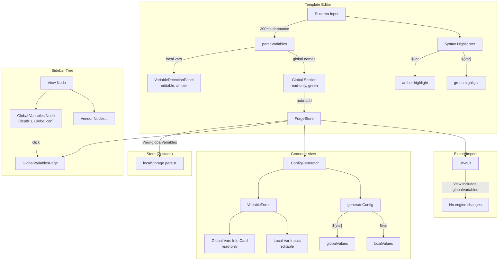

# Design Document

## References

- **Issue:** FORGE-5
- **Spec Path:** `.spec-workflow/specs/FORGE-5-global-variables-view-scoped-var/`

## Overview

FORGE-5 adds View-scoped Global Variables to Forge, leveraging the existing DNAC-compatible `${variable}` syntax to distinguish shared values from template-local `$variable` values. The implementation extends the parser, store, substitution engine, and UI components with minimal architectural change — the existing dual-capture-group regex, Zustand persist middleware, and component patterns make this a natural extension.

## Steering Document Alignment

### Product Standards (product.md)

- **Engineer-First UX**: GlobalVariablesPage follows the functional, terminal-inspired aesthetic — monospace for values, no unnecessary decoration
- **Copy-Paste Optimized**: Global variables reduce repetitive entry — fill shared values once (enable passwords, SNMP communities, NTP servers) instead of per-template
- **Section Independence**: Global variables cross-cut sections naturally (same enable password in Base, Auth, and TACACS sections) without redundant definition
- **DNAC Compatible**: Uses existing `${var}` syntax — zero new syntax, leverages team's DNAC muscle memory
- **Safe by Default**: Mask toggle is cosmetic only; no plaintext global values in exports (encrypted via existing `.stvault` mechanism)

### Technical Standards (tech.md)

- **Stack**: React 19 + Zustand 5 + Tailwind CSS 4 + Lucide React + Vite 8 (matches chosen stack)
- **Data Storage**: Global variables stored on `View` objects in localStorage via Zustand persist middleware — no new storage mechanisms
- **No External Integrations**: Feature is fully self-contained, no API calls
- **Encryption**: Global values ride on existing AES-256-GCM `.stvault` encryption — no changes to vault engine
- **Performance**: Auto-detection debounced at existing 300ms; substitution is a single `Record<string, string>` lookup per `${var}` — negligible overhead

### Project Structure (structure.md)

- **Components**: PascalCase — `GlobalVariablesPage.tsx` (new)
- **Functions**: camelCase — `addGlobalVariable()`, `autoSyncGlobals()`, `reorderGlobalVariables()`
- **Module Boundaries**: Parser handles detection, Store handles persistence, Generator handles substitution, UI handles display — clean layer separation per structure.md
- **File Organization**: New component in `src/components/`, type extensions in `src/types/index.ts`, lib extensions in `src/lib/` — follows existing directory conventions

## Code Reuse Analysis

### Existing Components to Leverage

- **`VariableDetectionPanel`** (`src/components/VariableDetectionPanel.tsx`): Accordion expand/collapse, inline editing, add/delete patterns — reused as the basis for the Global Variables management page
- **`TreeNode`** (`src/components/TreeNode.tsx`): Sidebar tree item with icon, label, depth, expand/collapse, action buttons — used for the new "Global Variables" node at depth 1
- **`VariableInput`** (`src/components/VariableInput.tsx`): Type-aware input rendering (string, ip, integer, dropdown) — reused in the Global Variables page for value editing
- **`parseVariables()`** (`src/lib/template-parser.ts`): Regex already has dual capture groups for `${var}` (group 1) and `$var` (group 2) — extended to return discriminated result
- **`substituteVariables()`** (`src/lib/substitution-engine.ts`): Already handles both `${var}` and `$var` replacement — extended to accept separate global/local value maps
- **`inferType()` / `toLabel()`** (`src/lib/template-parser.ts`): Type inference and label generation — reused for auto-created global variable definitions

### Integration Points

- **Zustand store** (`src/store/index.ts`): Global variables stored on `View` objects, persisted automatically via existing middleware
- **Vault engine** (`src/lib/vault-engine.ts`): No changes needed — `View` objects are already serialized in `.stvault` exports, so `globalVariables` rides along automatically
- **Syntax highlighter** (`src/lib/syntax-highlighter.ts`): Variable regex updated to emit distinct token classes for global vs local variables

## Architecture

The feature touches five layers: types, parser, store, substitution engine, and UI. Each layer is a clean extension of existing patterns.



### Modular Design Principles

- **Single File Responsibility**: `GlobalVariablesPage.tsx` handles global var CRUD UI; parser handles detection; store handles persistence
- **Component Isolation**: Global variables display in the editor sidebar is a self-contained section, not entangled with local variable editing
- **Service Layer Separation**: Parser detects and classifies → store persists → substitution engine resolves → UI displays
- **Utility Modularity**: No new utility files needed; existing `template-parser.ts` and `substitution-engine.ts` are extended in-place

## Components and Interfaces

### Component 1: Parser Enhancement (`template-parser.ts`)

- **Purpose:** Discriminate `$var` (local) from `${var}` (global) during variable detection
- **Interface change:**
  ```typescript
  // Before
  export function parseVariables(text: string): VariableDefinition[]

  // After
  export function parseVariables(text: string): ParsedVariables

  export interface ParsedVariables {
    local: VariableDefinition[];
    global: string[];  // Just names — full definitions live on View
  }
  ```
- **Dependencies:** None (pure function)
- **Reuses:** Existing regex, `inferType()`, `toLabel()`, deduplication logic

**Behavior:**
- Same regex: `/((?<=\s|^)\$\{([A-Za-z_]\w*)\}|(?<=\s|^)\$([A-Za-z_]\w*))/gm`
- Match group 2 (braced) → add to `global` array (deduplicated)
- Match group 3 (bare) → add to `local` array (full `VariableDefinition`)
- If same name appears as both `$foo` and `${foo}`, `${foo}` wins — name goes to `global` only, with a `hasShadow: true` flag for the UI warning indicator

### Component 2: Substitution Engine Enhancement (`substitution-engine.ts`)

- **Purpose:** Resolve `${var}` from global values and `$var` from local values during config generation
- **Interface change:**
  ```typescript
  // Before
  export function generateConfig(
    sections: TemplateSection[],
    values: Record<string, string>,
  ): GeneratedConfigOutput

  // After
  export function generateConfig(
    sections: TemplateSection[],
    localValues: Record<string, string>,
    globalValues?: Record<string, string>,
  ): GeneratedConfigOutput
  ```
- **Dependencies:** None (pure function)
- **Reuses:** Existing `substituteVariables()` internal function

**Behavior in `substituteVariables()`:**
1. First pass: replace `${variable}` with `globalValues[variable]` (if present and non-empty)
2. Second pass: replace `$variable` with `localValues[variable]` (if present and non-empty)
3. Unfilled variables left as-is (existing behavior preserved)

The `globalValues` parameter is optional with default `{}` for backward compatibility — all existing callers continue to work unchanged until updated.

### Component 3: Store Extensions (`store/index.ts`)

- **Purpose:** CRUD operations for global variables on View objects
- **New actions:**
  ```typescript
  // Global variable management
  addGlobalVariable(viewId: string, variable: VariableDefinition): void;
  updateGlobalVariable(viewId: string, name: string, updates: Partial<VariableDefinition>): void;
  deleteGlobalVariable(viewId: string, name: string): void;
  reorderGlobalVariables(viewId: string, orderedNames: string[]): void;
  autoSyncGlobals(viewId: string, detectedGlobalNames: string[]): void;
  ```
- **Dependencies:** Existing store patterns (`set((state) => { ... })`)
- **Reuses:** Existing timestamp/UUID patterns, persist middleware

**`autoSyncGlobals` behavior:**
- Called when parser detects `${var}` names in a template
- Adds new names to `View.globalVariables` with default type `string`, empty value
- Does NOT remove globals that are no longer detected (user may have added them manually or they exist in other templates)

### Component 4: GlobalVariablesPage (`components/GlobalVariablesPage.tsx`)

- **Purpose:** Dedicated management page for all global variables on a View
- **Interface:**
  ```typescript
  interface GlobalVariablesPageProps {
    viewId: string;
  }
  ```
- **Dependencies:** Store (global variable actions), `VariableInput` component
- **Reuses:** `VariableDetectionPanel` visual patterns (accordion, inline edit, add/delete)

**Features:**
- List all global variables with name, value input, type selector, mask toggle, description
- Add new global variable (manual entry)
- Delete global variable (with confirmation)
- Drag-to-reorder (controls display order in Generate view)
- Mask toggle: switches input `type` between `text` and `password`
- Empty state: "No global variables yet. Use `${variable_name}` syntax in your templates to auto-detect globals, or add one manually."

### Component 5: Sidebar Tree Node (`components/Sidebar.tsx` modification)

- **Purpose:** Add "Global Variables" entry to sidebar tree under each View
- **Position:** Depth 1, between View name and first Vendor
- **Icon:** `Globe` from Lucide React
- **Badge:** Count of global variables (hidden if 0)
- **Click behavior:** Sets `selectedNode` to `{ type: 'globalVariables', viewId }` and renders `GlobalVariablesPage` in the main content area
- **Reuses:** Existing `TreeNode` component

### Component 6: Editor Right Sidebar — Global Variables Section (`components/TemplateEditor.tsx` modification)

- **Purpose:** Show detected global variables as read-only entries in the editor's right sidebar
- **Position:** Above the existing local variables panel (new collapsible section)
- **Visual treatment:**
  - Globe icon + "Global Variables" header with count badge
  - Each global variable: name, current value (or "Not set"), green accent color
  - Read-only — no inline editing (button links to Global Variables page)
  - "Promote to Global" context action on local variables (see below)
- **Dependencies:** Store (read global variables for current View)

**"Promote to Global" action:**
- Appears as a button/icon on each local variable in the VariableDetectionPanel
- On click: performs find-replace in `rawText` (`$varName` → `${varName}`), then triggers `autoSyncGlobals`
- Re-parses text after replacement (via existing debounce flow)

### Component 7: Syntax Highlighter Update (`lib/syntax-highlighter.ts`)

- **Purpose:** Visually distinguish `${var}` (green) from `$var` (amber) in the editor overlay
- **Change:** Split `VARIABLE_RE` match into two token classes:
  - `'variable-global'` for `${...}` matches → CSS: `text-green-400` with `bg-green-500/20`
  - `'variable'` (unchanged) for `$...` matches → CSS: `text-amber-400` with `bg-amber-500/20`
- **Applied to:** All format tokenizers (CLI, XML, JSON, YAML)
- **Also update:** The overlay highlighter in `TemplateEditor.tsx` to apply corresponding background colors

### Component 8: Generate View — Global Variables Info Card (`components/ConfigGenerator.tsx` + `VariableForm.tsx` modification)

- **Purpose:** Display global variable values in the Generate view without inline editing
- **Position:** Top of the VariableForm, above local variable inputs
- **Visual treatment:**
  - Info card with globe icon, "Global Variables" header
  - Lists each global variable: name, value (masked if toggle is on), or "Not set" warning in amber
  - "Manage Global Variables" link → navigates to GlobalVariablesPage
  - Not editable inline — all editing happens on the dedicated page
- **Dependencies:** Store (read global variables and their values for current View)

### Component 9: GeneratedConfig Snapshot Update

- **Purpose:** Capture global variable values at config generation time for history
- **Change:** Add `globalVariableValues?: Record<string, string>` to `GeneratedConfig` type
- **Populated by:** `SaveGeneratedModal` when saving a generated config
- **Displayed by:** `GeneratedConfigViewer` — shows global values in a separate section

## Data Models

### View (extended)

```typescript
export interface View {
  id: string;
  name: string;
  vendors: Vendor[];
  globalVariables: VariableDefinition[];  // NEW — ordered array
  createdAt: string;
  updatedAt: string;
}
```

The `VariableDefinition` type is reused from the existing type:
```typescript
export interface VariableDefinition {
  name: string;
  label: string;
  type: VariableType;         // 'string' | 'ip' | 'integer' | 'dropdown'
  defaultValue: string;       // Acts as the "value" for globals
  options: string[];
  required: boolean;
  description: string;
  masked?: boolean;           // NEW — cosmetic mask toggle for sensitive values
}
```

For global variables, `defaultValue` serves as the actual value (there's no per-template override — the global value IS the value). This avoids introducing a separate `value` field and reuses the existing type cleanly.

### ParsedVariables (new)

```typescript
export interface ParsedVariables {
  local: VariableDefinition[];
  global: string[];
}
```

### GeneratedConfig (extended)

```typescript
export interface GeneratedConfig {
  id: string;
  name: string;
  modelId: string;
  sourceVariantId: string;
  sourceTemplateId: string;
  variableValues: Record<string, string>;
  globalVariableValues?: Record<string, string>;  // NEW — point-in-time snapshot
  fullConfig: string;
  sections: GeneratedSection[];
  notes: string;
  createdAt: string;
}
```

### SelectedNode (extended)

The sidebar selection state needs a new node type:

```typescript
// Existing selection types + new globalVariables type
type SelectedNode =
  | { type: 'view'; viewId: string }
  | { type: 'vendor'; viewId: string; vendorId: string }
  | { type: 'model'; viewId: string; vendorId: string; modelId: string }
  | { type: 'variant'; viewId: string; vendorId: string; modelId: string; variantId: string }
  | { type: 'generated'; configId: string }
  | { type: 'globalVariables'; viewId: string }  // NEW
```

## UI Impact Assessment

### Has UI Changes: Yes

### Visual Scope

- **Impact Level:** New screen (GlobalVariablesPage) + minor element additions (sidebar node, editor section, generate info card)
- **Components Affected:**
  - `GlobalVariablesPage.tsx` (NEW) — full CRUD management page
  - `Sidebar.tsx` — new TreeNode at depth 1
  - `TemplateEditor.tsx` — new global variables section in right sidebar, updated highlight colors
  - `ConfigGenerator.tsx` / `VariableForm.tsx` — global variables info card
  - `GeneratedConfigViewer.tsx` — global values display section
  - `SaveGeneratedModal.tsx` — capture global values on save
- **Prototype Required:** Yes — GlobalVariablesPage has 5+ data elements (name, value, type, mask, description, reorder) and the editor sidebar split needs visual validation

### Prototype Artifacts

- **Stitch Screen IDs:** [To be filled during prototype phase]
- **Playground File:** [To be filled during prototype phase]
- **Reference HTML/Mockup:** [To be filled during prototype phase]

### Design Constraints

- **Theme Compatibility:** Dark mode only (Forge is dark-only per BRANDING.md)
- **Existing Patterns to Match:** `VariableDetectionPanel` accordion style, `TreeNode` sidebar style, Forge dark theme tokens (`forge-charcoal`, `forge-graphite`, amber/green accents)
- **Responsive Behavior:** Desktop-first (Forge is a desktop tool); GlobalVariablesPage stacks vertically on narrow viewports

### Visual Approval Gate

> **BLOCKING:** If `Prototype Required` is **Yes**, no UI implementation task may begin until:
> 1. A Stitch mockup or equivalent visual is created and reviewed
> 2. A Playground prototype (or reference HTML) is interactively approved by the user
> 3. Both artifact paths are filled in above
>
> This gate is enforced in Phase 4 — the orchestrator MUST check this section before dispatching any task tagged with `ui:true`.

## Open Questions

> **GATE:** All blocking questions must be resolved before this document can be approved.

### Blocking (must resolve before approval)

None — all design decisions follow directly from the approved requirements and existing codebase patterns.

### Resolved

- [x] ~~Parser return type: new type or extend existing?~~ — New `ParsedVariables` interface with `{ local, global }`. Clean break, only ~3 call sites to update.
- [x] ~~Global variable value storage: separate field or reuse `defaultValue`?~~ — Reuse `defaultValue` on `VariableDefinition`. Globals don't have per-template overrides, so `defaultValue` IS the value. Avoids type proliferation.
- [x] ~~Vault engine changes needed?~~ — No. `globalVariables` lives on `View` objects which are already serialized. Automatic.
- [x] ~~Routing for GlobalVariablesPage?~~ — No URL routing. Sidebar click sets `selectedNode.type = 'globalVariables'` and the main content area conditionally renders `GlobalVariablesPage`. Consistent with existing view/vendor/model/variant selection pattern.
- [x] ~~Backward compatibility for `generateConfig()`?~~ — `globalValues` parameter is optional with default `{}`. Existing callers work unchanged.

## Error Handling

### Error Scenarios

1. **Same variable name as both `$foo` and `${foo}` in a template**
   - **Handling:** `${foo}` (global) takes precedence. Parser puts name in `global` array only, not `local`. Editor shows a warning indicator (amber triangle) next to the variable name.
   - **User Impact:** Sees a warning: "`${foo}` overrides `$foo` — this variable is treated as global"

2. **Global variable referenced in template but not yet valued**
   - **Handling:** `substituteVariables()` leaves `${var}` unsubstituted (existing behavior for unfilled vars). Generate view shows "Not set" warning with link to Global Variables page.
   - **User Impact:** Sees the raw `${var}` in generated output + amber warning in the Generate view

3. **Import merges global variables with name conflicts**
   - **Handling:** Imported values overwrite existing values for same-named globals. New names are added. Existing names not in import are preserved (additive merge).
   - **User Impact:** Transparent — merged globals appear in the list with imported values

4. **View deleted while GlobalVariablesPage is open**
   - **Handling:** Store cascade-deletes `globalVariables` with the View. If `selectedNode` references deleted View, reset to null.
   - **User Impact:** Redirected to empty state / welcome screen

## Testing Strategy

### Unit Tests (Vitest)

- `template-parser.test.ts`: Verify `parseVariables()` returns correct `{ local, global }` split for mixed templates
- `substitution-engine.test.ts`: Verify `generateConfig()` resolves `${var}` from global values and `$var` from local values independently
- `syntax-highlighter.test.ts`: Verify token classes distinguish `variable-global` from `variable`

### Manual Verification

- Full workflow: create View → add template with `${var}` and `$var` → verify sidebar tree node → verify editor highlighting → verify Global Variables page → set values → generate config → verify substitution → save to history → verify snapshot → export .stvault → import into fresh state → verify globals restored
- Promote to Global: right-click local var → promote → verify text replacement and auto-add to globals
- Mask toggle: enable mask on sensitive global → verify password input display
