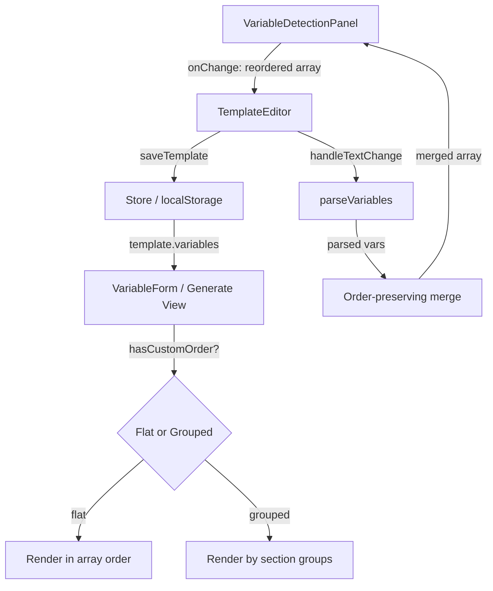

# Design Document

## References

- **Issue:** FORGE-6
- **Spec Path:** `.spec-workflow/specs/FORGE-6-drag-to-sort-variables/`

## Overview

Add drag-to-sort to the VariableDetectionPanel in the template editor's right sidebar, using the same drag pattern already established in GlobalVariablesPage. The user-defined variable order persists via the existing `saveTemplate()` flow and controls Generate view form layout. The main technical challenge is preserving custom order when `parseVariables` re-detects variables from edited template text.

## Steering Document Alignment

### Technical Standards (tech.md)
- Browser-native, no new dependencies. HTML5 drag-and-drop API (already used for sections and global variables).
- No backend changes — variable order persists through existing localStorage via `saveTemplate()`.

### Project Structure (structure.md)
- All changes scoped to existing files. No new files created.
- Follows component naming and code conventions (camelCase functions, PascalCase components).

## Code Reuse Analysis

### Existing Components to Leverage
- **GlobalVariablesPage drag pattern** (`src/components/GlobalVariablesPage.tsx:105-128`): Direct template for drag state management, event handlers, and visual feedback. Adapt from name-based to index-based reordering.
- **GripVertical icon** (from `lucide-react`): Already imported and used in GlobalVariablesPage and TemplateEditor section tabs.
- **VariableDetectionPanel `onChange` callback**: Already wired — parent (TemplateEditor) receives the full updated array. No new callback needed.

### Integration Points
- **TemplateEditor merge logic** (`src/components/TemplateEditor.tsx`): The `handleTextChange` callback re-parses variables on text edit. Currently rebuilds the array in parse order. Must be modified to preserve existing custom order.
- **VariableForm** (`src/components/VariableForm.tsx`): Currently groups variables by section. Must support a flat-order mode for custom-ordered templates.
- **Store `saveTemplate()`** (`src/store/index.ts`): Already persists the full Template object including `variables` array in order. No changes needed.

## Architecture

The design adds drag-sort to VariableDetectionPanel using the proven pattern, with two supporting changes: (1) order-preserving merge in TemplateEditor, and (2) a flat-order rendering path in VariableForm.



## Components and Interfaces

### VariableDetectionPanel (MODIFY)
- **Purpose:** Display and manage template variables in the right sidebar
- **Changes:**
  - Add `dragIndex` and `dragOverIndex` state
  - Add `handleDragStart(index)`, `handleDragOver(e, index)`, `handleDragEnd()` handlers
  - Add `draggable` attribute and drag event handlers to each variable row
  - Add `GripVertical` icon to each row header (left of variable name)
  - Add visual feedback: opacity-50 on dragged row, amber border on drop target
  - Reorder calls existing `onChange(reorderedArray)` — no new API
- **Dependencies:** `onChange` callback from TemplateEditor (existing)
- **Reuses:** Drag pattern from GlobalVariablesPage

### TemplateEditor — merge logic (MODIFY)
- **Purpose:** Preserve user-defined variable order when template text is re-parsed
- **Changes:**
  - In `handleTextChange`, after calling `parseVariables()`, merge results with existing variable array:
    1. Keep all existing variables that still appear in parsed output, in their current order
    2. Append any newly detected variables at the end
    3. Remove any variables no longer detected in text
  - Add a `hasCustomOrder` flag on the Template (or derive from whether array has been manually reordered)
- **Dependencies:** `parseVariables()` from template-parser
- **Reuses:** Existing merge pattern (already preserves label, type, description — extend to preserve position)

### VariableForm (MODIFY)
- **Purpose:** Render variable input fields in the Generate view
- **Changes:**
  - Add a check: if the template has custom variable order, render variables in flat array order (skip section grouping)
  - If no custom order (legacy), fall back to existing `groupVariablesBySection()` behavior
- **Dependencies:** Template object with variables array
- **Reuses:** Existing rendering components (VariableInput rows)

## Data Models

### VariableDefinition (NO CHANGE)
```
{
  name: string
  label: string
  type: VariableType
  defaultValue: string
  options: string[]
  required: boolean
  description: string
  masked?: boolean
}
```

No `order` field needed — array index position is the order. This is consistent with how section order works.

### Template (MINOR ADDITION)
```
{
  ...existing fields...
  customVariableOrder?: boolean  // true once user has manually reordered
}
```

This flag distinguishes "user has intentionally reordered" from "array is in detection order." Used by VariableForm to decide between flat vs section-grouped rendering. Set to `true` on first drag-reorder. Default `undefined`/`false` for legacy templates.

## UI Impact Assessment

### Has UI Changes: Yes

### Visual Scope
- **Impact Level:** Minor element additions — adding drag handles to existing variable rows
- **Components Affected:** VariableDetectionPanel (drag handles + visual feedback)
- **Prototype Required:** No — single-element additions with clear analogues (identical to existing GlobalVariablesPage drag pattern)

### Design Constraints
- **Theme Compatibility:** Dark mode only (Forge is dark-mode-only per BRANDING.md)
- **Existing Patterns to Match:** GlobalVariablesPage drag handles (GripVertical 14px, slate-500, same opacity/border feedback)
- **Responsive Behavior:** N/A — desktop-only tool

## Open Questions

### Resolved

- [x] ~~Should we add up/down arrow quick-action buttons (accessibility)?~~ — Defer to a follow-up. The drag pattern matches GlobalVariablesPage which also has arrow buttons, but FORGE-6 scope is drag-only. Can add arrows later if needed.
- [x] ~~Should Generate view offer a toggle between custom and section-grouped order?~~ — No toggle for now. Custom order = flat render, no custom order = section-grouped. Simple and predictable. Toggle can be added later if users want it.
- [x] ~~How to detect "custom order" vs "detection order"?~~ — Add `customVariableOrder?: boolean` to Template. Set on first drag. Legacy templates default to grouped.

## Error Handling

### Error Scenarios
1. **Drag outside panel bounds**
   - **Handling:** `handleDragEnd` checks if both `dragIndex` and `dragOverIndex` are valid before reordering. If either is null, no-op.
   - **User Impact:** Variable returns to original position. No data loss.

2. **Drag during text edit re-parse**
   - **Handling:** Re-parse happens synchronously on text change. Drag state is independent (local to VariableDetectionPanel). If a re-parse fires mid-drag, the drag indices may become stale — reset drag state on `variables` prop change.
   - **User Impact:** Drag cancels cleanly. User can re-drag.

## Testing Strategy

### Unit Tests
- Test order-preserving merge: existing variables retain position, new variables append, removed variables disappear
- Test `customVariableOrder` flag: set on reorder, preserved through save/load
- Test VariableForm flat vs grouped rendering based on `customVariableOrder`

### Manual Verification
- Drag variables in VariableDetectionPanel, verify Generate view order updates
- Edit template text (add/remove variables), verify custom order preserved
- Save and reload — verify order persists
- Export/import via .stvault — verify order roundtrips
