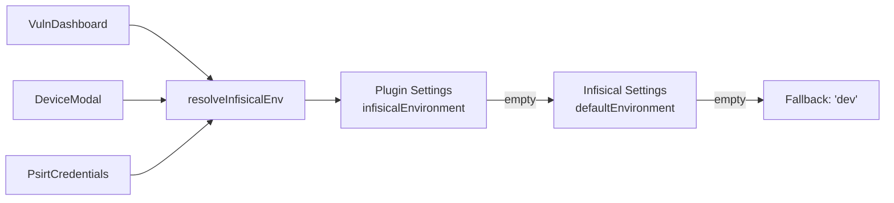

# Design Document

## References

- **Issue:** FORGE-63
- **Spec Path:** `.spec-workflow/specs/FORGE-63-infisical-environment-per-plugin/`

## Overview

Add per-plugin Infisical environment configuration by introducing an `infisicalEnvironment` field to sidecar plugin settings schemas and a shared helper function that resolves the correct environment through a plugin → global → fallback chain. All 6 existing call sites that inline `defaultEnvironment` resolution are refactored to use the helper.

## Steering Document Alignment

### Technical Standards (tech.md)

- Follows the existing plugin settings pattern: declare in manifest `settingsSchema`, auto-rendered by `SettingsForm`, stored in `PluginRegistration.settings`
- Helper function follows the lib/ utility pattern — pure function, no side effects, testable in isolation

### Project Structure (structure.md)

- Helper placed in `src/lib/` alongside other shared utilities (`validators.ts`, `storage-service.ts`)
- No new components — leverages existing `SettingsForm` auto-rendering

## Code Reuse Analysis

### Existing Components to Leverage

- **`SettingsForm` (PluginPanel.tsx:36-66)**: Auto-renders form fields from `settingsSchema`. Adding a field to the manifest is all that's needed for UI.
- **`PluginManifest.settingsSchema` (types/plugin.ts:12)**: Already supports `Record<string, SettingsField>` — no type changes needed.
- **`useForgeStore.getPlugin()` (store/index.ts)**: Already provides plugin settings lookup. The helper wraps two `getPlugin()` calls (calling plugin + Infisical plugin).

### Integration Points

- **`SecretsProvider` interface (types/secrets-provider.ts)**: Already takes `environment` as a parameter on every method. No changes needed to the provider layer.
- **`PluginRegistration.settings` (types/plugin.ts:39)**: Already stores arbitrary `Record<string, string | number | boolean>`. The new `infisicalEnvironment` field fits naturally.

## Architecture

The design adds a single indirection layer between call sites and the Infisical environment value:

```
BEFORE (current):
  Call site → infisicalPlugin.settings.defaultEnvironment || 'dev'

AFTER:
  Call site → resolveInfisicalEnv(callingPluginName) → plugin env || global env || 'dev'
```



GlobalVariablesPage continues to read `defaultEnvironment` directly — it's app-scoped, not plugin-scoped.

## Components and Interfaces

### `resolveInfisicalEnv` Helper

- **Purpose:** Single point of resolution for the Infisical environment slug given a plugin context.
- **Location:** `src/lib/infisical-env.ts` (new file)
- **Interface:**
  ```typescript
  function resolveInfisicalEnv(
    callingPluginName: string,
    getPlugin: (name: string) => PluginRegistration | undefined,
  ): string;
  ```
- **Resolution chain:**
  1. `getPlugin(callingPluginName)?.settings?.infisicalEnvironment` — plugin-specific override
  2. `getPlugin('forge-infisical')?.settings?.defaultEnvironment` — global default
  3. `'dev'` — hardcoded fallback
- **Dependencies:** None (pure function, receives `getPlugin` as parameter)
- **Reuses:** Existing `getPlugin` Zustand selector — no new store actions needed

### Vuln-Cisco Manifest Update

- **Purpose:** Add `infisicalEnvironment` to the vuln-cisco plugin's `settingsSchema` so the auto-rendered settings form includes it.
- **Location:** `src/plugins/vuln-cisco/manifest.ts`
- **Change:**
  ```typescript
  settingsSchema: {
    infisicalEnvironment: {
      type: 'string',
      label: 'Infisical Environment',
      description: 'Infisical environment slug for this plugin\'s secrets (e.g., "vulnerabilities"). Leave blank to use the global default.',
      required: false,
    },
  },
  ```
- **Dependencies:** None — `SettingsForm` handles rendering automatically.

### Call Site Refactoring (6 locations)

Each call site replaces the inline pattern:

```typescript
// BEFORE
const env = (infisicalPlugin?.settings?.defaultEnvironment as string) || 'dev';

// AFTER
const env = resolveInfisicalEnv('forge-vuln-cisco', getPlugin);
```

| File                   | Lines     | Call Sites                              |
| ---------------------- | --------- | --------------------------------------- |
| `VulnDashboard.tsx`    | ~202      | 1 — scan launch credential resolution   |
| `DeviceModal.tsx`      | ~61, ~98  | 2 — save SNMP + read SNMP               |
| `PsirtCredentials.tsx` | ~61, ~326 | 2 — credential check + credential setup |

**Not changed:** `GlobalVariablesPage.tsx` (~176, ~615) — continues using Infisical `defaultEnvironment` directly because global variables are app-scoped.

## Data Models

No data model changes. The `infisicalEnvironment` value is stored in the existing `PluginRegistration.settings` record, which is already a `Record<string, string | number | boolean>` persisted to localStorage. No migration needed — an absent key resolves to `undefined`, which the helper treats as "use fallback."

## UI Impact Assessment

### Has UI Changes: No

The `SettingsForm` component in `PluginPanel.tsx` auto-renders form fields from `settingsSchema`. Adding `infisicalEnvironment` to the vuln-cisco manifest causes a new text input to appear automatically in the vuln scanner's plugin settings panel. No custom UI work, no new components, no layout changes.

## Open Questions

### Blocking (must resolve before approval)

_None._

### Resolved

- [x] ~~Should the helper live in `src/lib/` or `src/plugins/infisical/`?~~ — `src/lib/infisical-env.ts`. It's consumed by vuln-cisco components, not just the Infisical plugin. Placing it in `lib/` avoids a cross-plugin import dependency.
- [x] ~~Should the helper be a Zustand action or a pure function?~~ — Pure function that receives `getPlugin` as a parameter. This keeps it testable without mocking the store and follows the pattern of `validators.ts`.

## Error Handling

### Error Scenarios

1. **Plugin not registered / settings undefined:**
   - **Handling:** `getPlugin()` returns `undefined`; optional chaining returns `undefined`; helper moves to next fallback in chain.
   - **User Impact:** None — resolution silently falls back to global default or `'dev'`. Same behavior as current code.

2. **infisicalEnvironment set to invalid slug:**
   - **Handling:** The Infisical API call will fail with a 404/error when the environment doesn't exist. Existing error handling in each call site (try/catch) already surfaces this to the user.
   - **User Impact:** Same error UX as today when `defaultEnvironment` is misconfigured — error message shown in the relevant component.

## Testing Strategy

### Unit Tests

- `resolveInfisicalEnv` helper — test the three-tier fallback chain:
  - Plugin env set → returns plugin env
  - Plugin env empty, global env set → returns global env
  - Both empty → returns `'dev'`
  - Calling plugin not registered → falls through to global
  - Infisical plugin not registered → returns `'dev'`

### Manual Verification

- Register vuln-cisco plugin, set `infisicalEnvironment` to a non-default environment
- Run a vulnerability scan — verify credentials resolve from the configured environment
- Leave `infisicalEnvironment` blank — verify fallback to Infisical `defaultEnvironment`
- Check GlobalVariablesPage sync still uses the global default (no regression)
